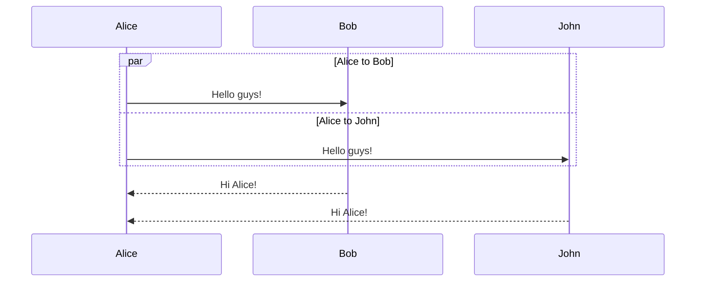
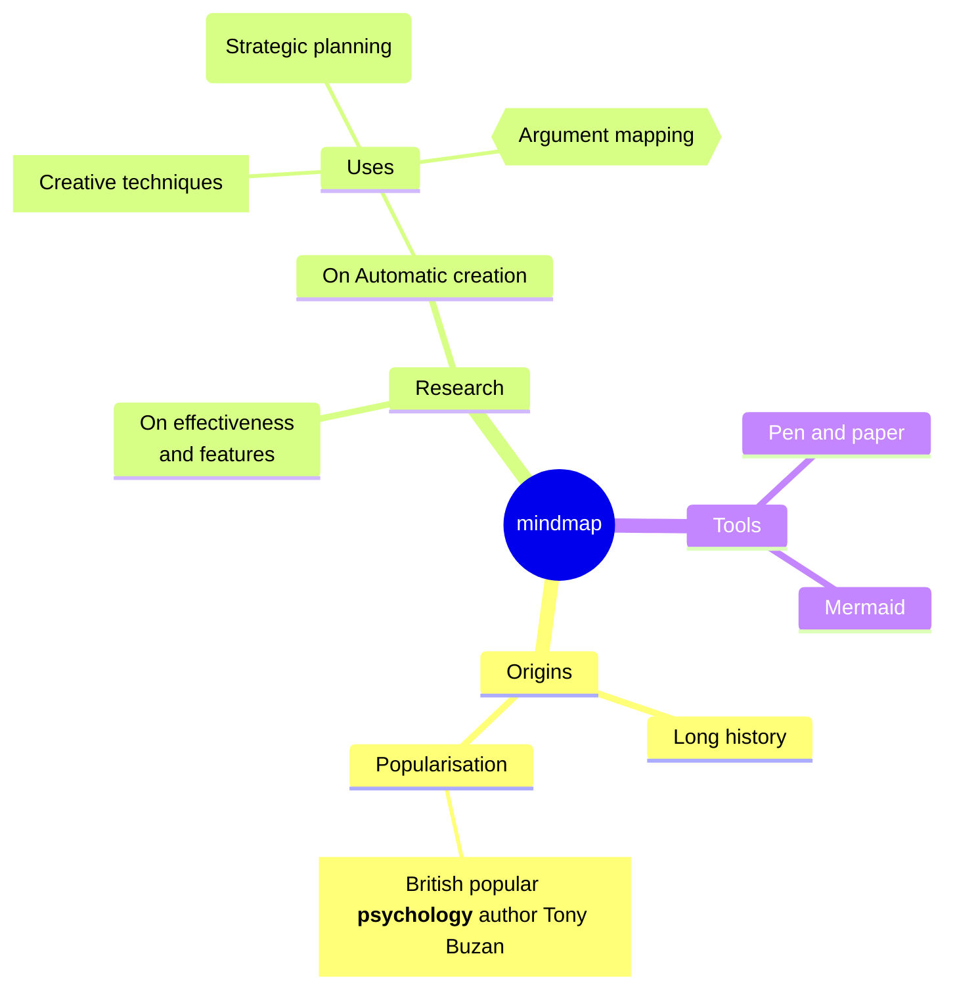

Examples of Mermaid diagram in markdown

```mermaid
%%{ init: { "sequence": { "wrap": true, "width":300 } } }%%
sequenceDiagram
    par Alice to Bob
        Alice->>Bob: Hello guys!
    and Alice to John
        Alice->>John: Hello guys!
    end
    %% A comment
    Bob-->>Alice: Hi Alice!
    John-->>Alice: Hi Alice!
```

```mermaid
%%{ init: { theme: 'forest' } }%%
mindmap
  root((mindmap))
    Origins
      Long history
      ::icon(fa fa-book)
      Popularisation
        pop["`British popular **psychology** author Tony Buzan`"]
    Research
      %% My research
      On effectiveness<br/>and features
      On Automatic creation
        Uses
          a[Creative techniques]
          b(Strategic planning)
          c{{Argument mapping}}
    Tools
      :::additional class
      Pen and paper
      Mermaid
```
